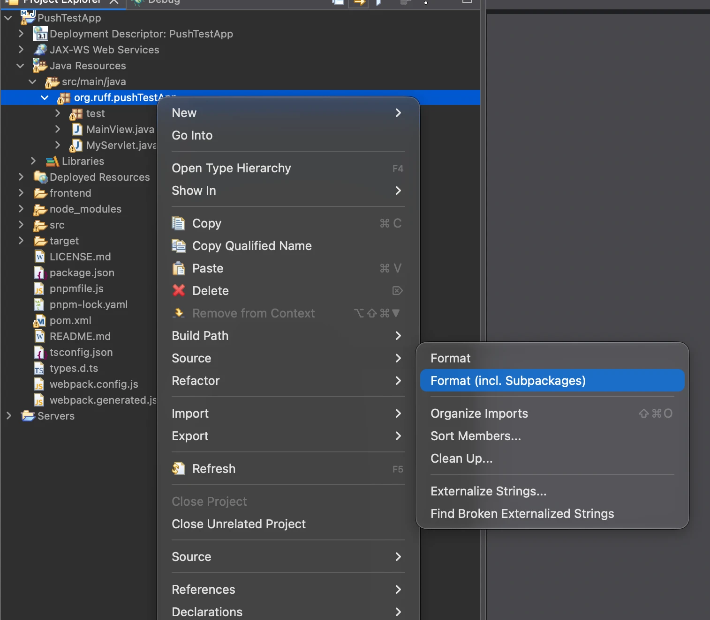
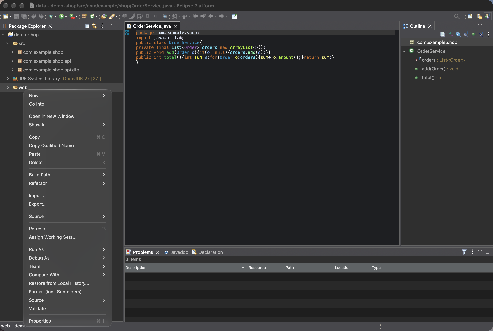
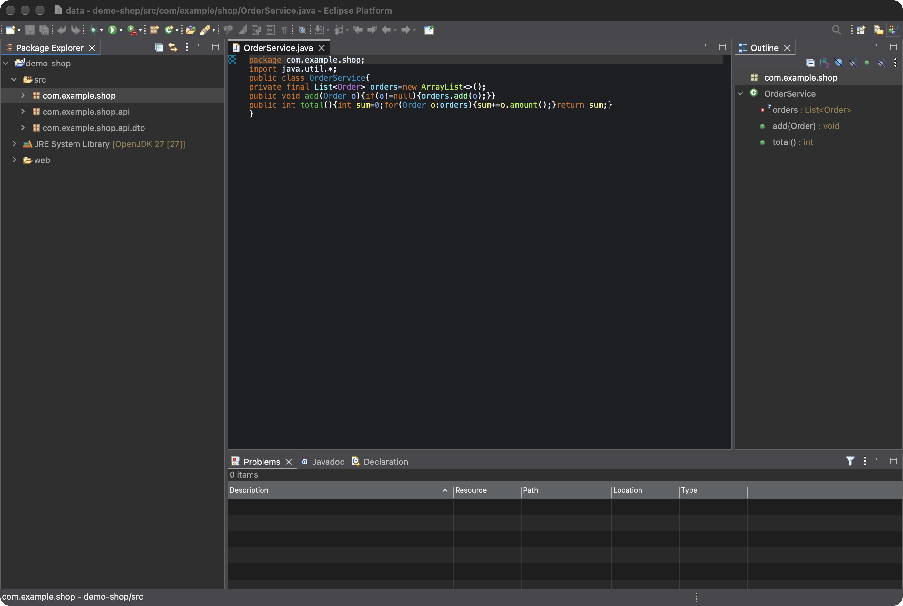
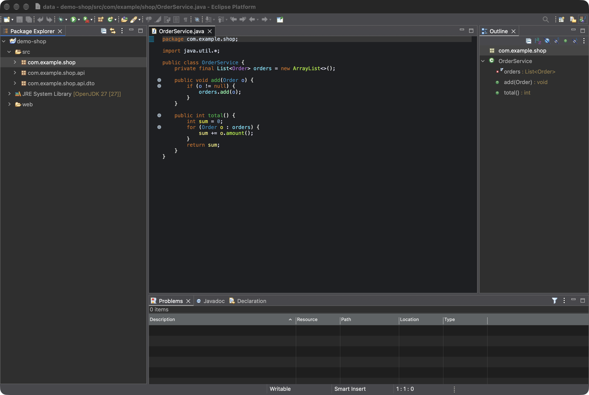

# Bulk Format (incl. Subfolders) for Eclipse

Eclipse's built-in *Source > Format* on a package only formats the Java files directly inside that
package – not its subpackages and not any other file type. This plugin formats **all files** of a
package, folder or project **including all subpackages and subfolders**, each with the formatter
Eclipse would use for it:

- **Source > Format (incl. Subpackages)** in the context menu of packages
- **Format (incl. Subfolders)** in the context menu of folders, source folders and projects

| Files | Formatted with |
|---|---|
| Java | the project's Java formatter settings (like *Source > Format*) |
| XML, HTML, CSS, JSP, … | the formatter of their editor, e.g. Eclipse Web Tools (WTP) |
| JSON, YAML, JavaScript, TypeScript, SCSS, XSD, … | their language server, e.g. Wild Web Developer (LSP4E) |
| anything else with a formatting editor or language server | that editor / language server |

Files without a formatter (plain text, Markdown, `.properties`, binary files, …) are skipped.
Which file types are supported depends on the plugins installed in your Eclipse.

- Runs immediately in the background without confirmation; only errors are shown.
- Files that are already formatted are left untouched.
- Files open in an editor with unsaved changes are formatted in the editor but not saved.
- Skips derived resources, output folders, `node_modules` and dot-files/-folders (`.git`, `.settings`, …).
- Formatting via an editor briefly opens that editor in the background.

| Before | After |
|---|---|
|  |  |

## Install

In Eclipse, choose *Help > Install New Software…* and use this update site:

    https://sebastianruff.github.io/eclipse-bulk-formatter/

Select “Bulk Format (incl. Subfolders)”, finish the wizard and restart Eclipse.
The update site is PGP-signed. When Eclipse asks whether to trust the signing key, check that the
fingerprint is `8FEA 6CD6 3AF8 D180 5DC8  9737 081E E7BE B9AC A451` ([signing-key.asc](signing-key.asc)).

Requires Eclipse running on Java 21 or newer (built and tested against Eclipse 2026-06).

## Build

Requires Maven 3.9+ and JDK 21+.

    mvn clean verify

The update site is created in `site/target/repository`
(zipped: `site/target/*.zip`).
Every push to `main` builds, tests and publishes the update site to GitHub Pages.

## Development

Import all projects via *File > Import > Existing Projects* into an Eclipse with PDE
(“Eclipse IDE for RCP and RAP Developers”) and launch *Run As > Eclipse Application*.

## Screenshots

Except for `package-source-menu.png` (taken by hand in a real project, since the Source submenu only opens on real input),
the images in `marketplace/screenshots` are generated with a real Eclipse (WTP and Wild Web Developer included)
and a demo project:

    mvn verify -Pscreenshots

This opens an Eclipse window for a few seconds and needs the macOS permission for screen recording.

## License

[Eclipse Public License 2.0](LICENSE)
